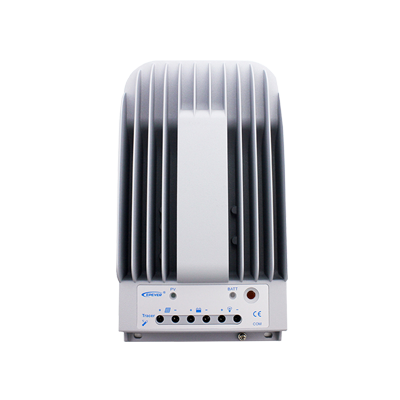
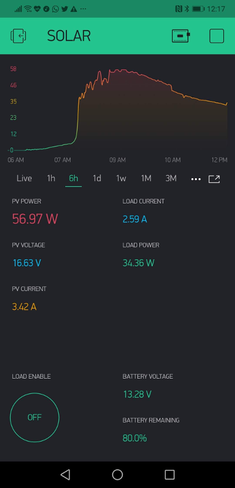

# Tracer-RS485-Modbus-Blynk
Tracer-RS485-Modbus for new Blynk


# Tracer-RS485-Modbus-Blynk V2.0 - RELOADED

### An Arduino project to connect the `EPSolar`/`EPEver` `Tracer A/B`, `Xtra`, `Triton` Series MPPT Solar Controllers (RS-485 Modbus) to an `ESP8266` and monitor it using the `Blynk` mobile app, the reloaded version!

This is almost complete rewrite of the original [project](https://github.com/jaminNZx/Tracer-RS485-Modbus-Blynk), with ton of improvements, refactored code, brand new Blynk project, and wider compatibility of RS485 convertrs.

Feel free to make pull requests if you wish to help improving.
There is also a support forum on the Blynk community forums: http://community.blynk.cc/t/epsolar-tracer-2210a-charge-controller-blynk-epic-solar-monitor/10596


## Hardware




* [EPSolar/EPEver Tracer A/B-Series](https://www.aliexpress.com/wholesale?catId=0&initiative_id=SB_20170114172728&SearchText=tracer+mppt+rs485)

* [RS485 UART Module](https://www.aliexpress.com/wholesale?catId=0&initiative_id=SB_20170114172807&SearchText=uart+rs485) (~~not the MAX485 chip!~~ - `@tekk:` I'm using [MAX485 cheapo module](doc/max485_module.jpg) and it works fine!)

* [ESP8266 Dev Board](https://www.aliexpress.com/wholesale?catId=0&initiative_id=SB_20170114172938&SearchText=esp8266+mini)

* An old ethernet cable with RJ45 connector you are happy to cut open


## Sample screenshot




## Software

* [Blynk](http://www.blynk.cc/) Mobile App ([iOS](https://itunes.apple.com/us/app/blynk-iot-for-arduino-rpi/id808760481?mt=8) & [Android](https://play.google.com/store/apps/details?id=cc.blynk&hl=en))
* Arduino IDE 1.6.9+
* The project sketch


## Wiring

Cut open your ethernet cable and split out pin 3, 5, 7 (B, A, GND). Refer to [Tracer Modbus PDF](doc/1733_modbus_protocol.pdf) for additional info.

Follow the wiring guide below: ~~(note that the 2-pol switch is only needed during flashing)~~ **No longer needed!**


> Note: as @Don Vukovic noted, there is probably reversed RX and TX on this schematic. Correct is: DI to TX, and RO to RX


## Setup

### Libraries

Follow links to get them.

* [Blynk Library](https://github.com/blynkkk/blynk-library)
* [SimpleTimer](https://github.com/schinken/SimpleTimer)
* [ModbusMaster](https://github.com/4-20ma/ModbusMaster)

### Virtual PIN Mapping

```cpp
/*
   Virtual Pins - Base. (For Blynk)
*/
#define vPIN_PV_POWER                   V1
#define vPIN_PV_CURRENT                 V2
#define vPIN_PV_VOLTAGE                 V3
#define vPIN_LOAD_CURRENT               V4
#define vPIN_LOAD_POWER                 V5
#define vPIN_BATT_TEMP                  V6
#define vPIN_BATT_VOLTAGE               V7
#define vPIN_BATT_REMAIN                V8
#define vPIN_CONTROLLER_TEMP            V9
#define vPIN_BATTERY_CHARGE_CURRENT     V10
#define vPIN_BATTERY_CHARGE_POWER       V11
#define vPIN_BATTERY_OVERALL_CURRENT    V12
#define vPIN_LOAD_ENABLED               V14
```


## Reference

* [Tracer A/B Series MPPT Solar Controller - Modbus Protocol](doc/1733_modbus_protocol.pdf)

* MAX485 module:


I'm using this cheapo module and it works quite fine.
It's powered from `+5V` from ESP8266, and wired as following:

- MAX485 module <-> ESP8266
	- `DI` -> `D10` / `GPIO1` / `TX`
	- `RO` -> `D9` / `GPIO3` / `RX`
	- `DE` and `RE` are interconnected with a jumper and then connected do eighter pin `D1` or `D2`
	- `VCC` to `+5V` / `VIN` on ESP8266


- Tracer A/B MPPT Controller Ethernet cable <-> MAX485
	- Ethernet green, pin `5` -> `A`
	- Ethernet blue, pin `3` -> `B`
	- Ethernet brown, pin `7` -> `GND` on module **and** ESP8266 `GND` pin
		- -> to prevent ground loops - **important!**


## `@tekk`'s V2 Changelog
- Rewrote whole sketch
- Tried to utilize HardwareSerial `UART2` - no avail :(
	- `ModbusMaster` library is incopatible with `SoftwareSerial`, (don't even try)... Would need to rewrite whole `ModbusMaster`, so Hardware UART is the only option for smooth & seamless communication because of the interrupt driven data transmission, more precise timing, and HW buffer, and stuff
- Optimized for very cheap MAX485 module, you can buy it from usual sources...
- **Feature:** Added option to switch the output of the Tracer MPPT Controller ON/OFF from the Blynk app
- **Improvement:** You no longer need to disconnect and reconnect Modbus RS485 Serial port from the ESP8266 while uploading
- Code rewrote to use as little magic constants as possible
- Added `preTransmission` abd `postTransmission` Modbus handling / signalling, just to be sure...
- Added calls to `ESP.wdtDisable()` and `ESP.wdtEnable(1)`, temporary System Watchdog shutdown and later found it to be not necessarry
	- Avoids unwanted rebooting of ESP8366 while receiving data from the Modbus
- Added more debug outputs and results to USB Serial


## Credits
- `@prfiredragon:`
   - CHanged for the new Blynk and Blynk OTA 

- `@jaminNZx:`
	- Thanks to subtafuge on [Reddit](https://www.reddit.com/r/esp8266/comments/59dt00/using_esp8266_to_connect_rs485_modbus_protocol/) for lending me his working Tracer RS485 code! 

- `@tekk:`
	- Feel free to contact me about my code changes in this version
	- Thanks to [@jaminNZx](https://github.com/jaminNZx) for the original code. Big up!
